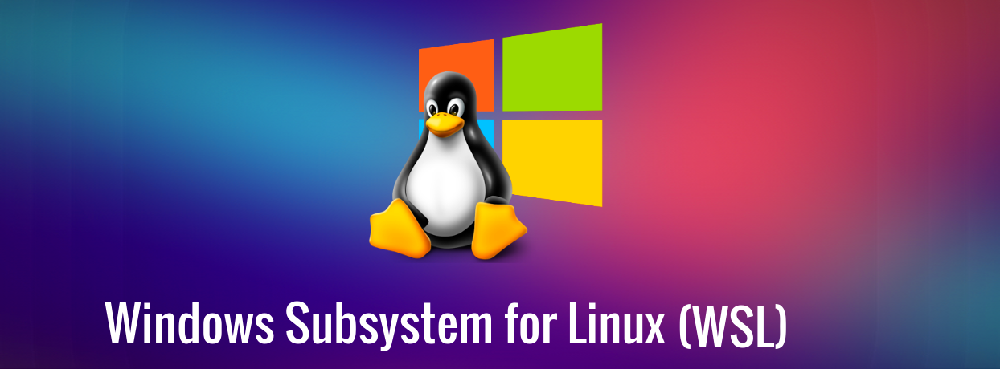

#  Windows SuBsystem Linux(WSL) 

## Índice

1. [Introducción (¿Qué es WSL?)](introduccion.md)
    - Explicación de qué es WSL.
    - Diferencias entre WSL 1 y WSL 2.
      
2. [Instalación (Comandos)](instalacion.md)

   - Instrucciones paso a paso para habilitar y configurar WSL en Windows 11.
     
5. [Instalación de un Debian y un Ubuntu (Guía)](instalaciondebianubuntu.md)

   - Instrucciones detalladas para instalar y configurar Debian y Ubuntu.
     
7. [Procesos asociados WSL](procesos.md)

   - Gestión y monitorización de procesos en WSL.
   - Integración y ejecución de comandos de Windows desde WSL y viceversa.
   - Herramientas y comandos útiles para la administración del entorno WSL.

9. [Referencias](referencias.md)

### Licencia

Este proyecto está licenciado bajo la [MIT License](LICENSE). Siéntete libre de usar, modificar y distribuir el contenido de este repositorio conforme a los términos de la licencia.
 
This work is licensed under <a href="http://creativecommons.org/licenses/by-sa/4.0/?ref=chooser-v1" target="_blank" rel="license noopener noreferrer" style="display:inline-block;">Attribution-ShareAlike 4.0 International</a>
 

 ### AUTOR

 :pushpin: [David Álvarez Padilla](https://github.com/Davidpadilla24)

