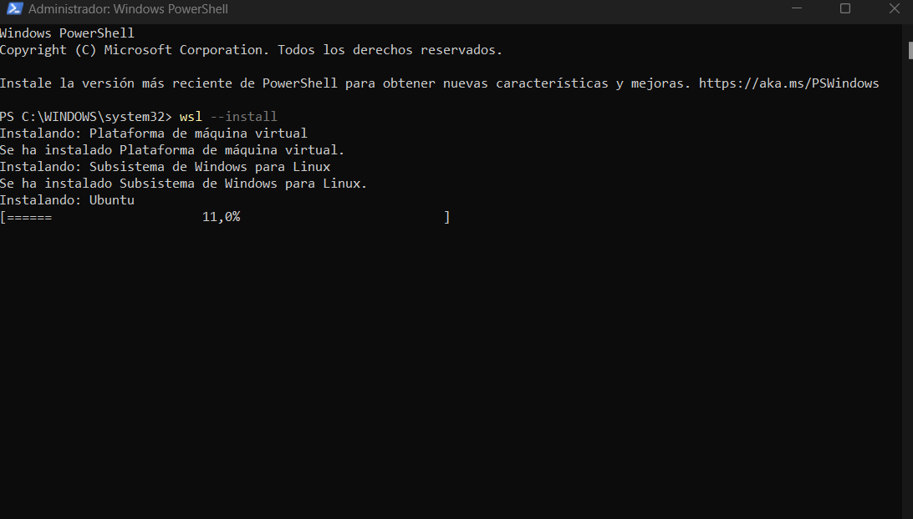
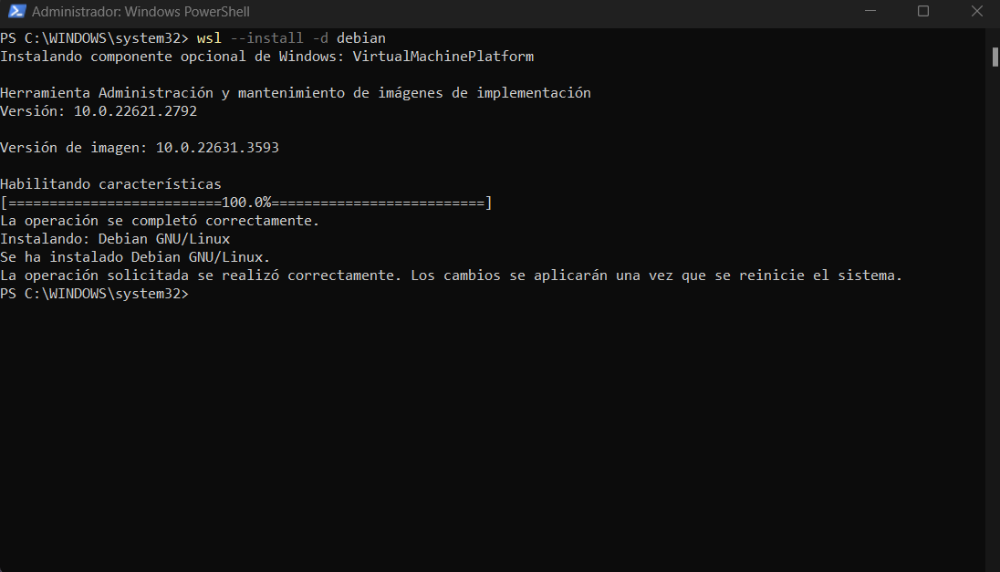
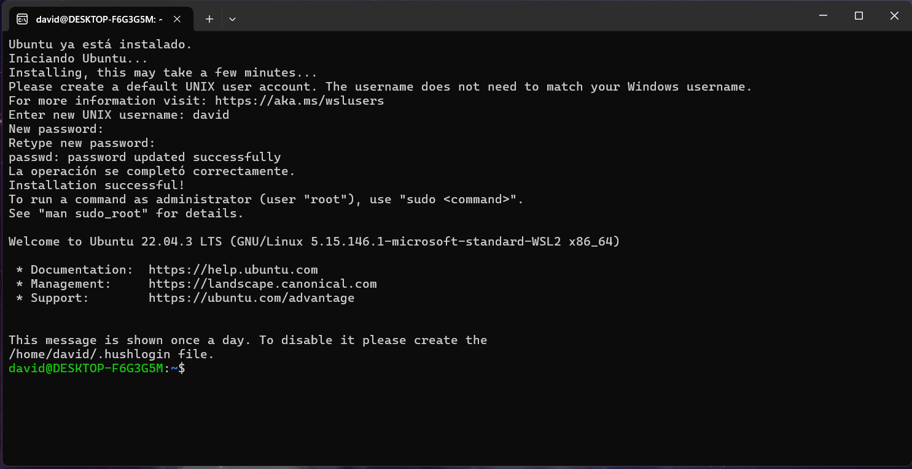
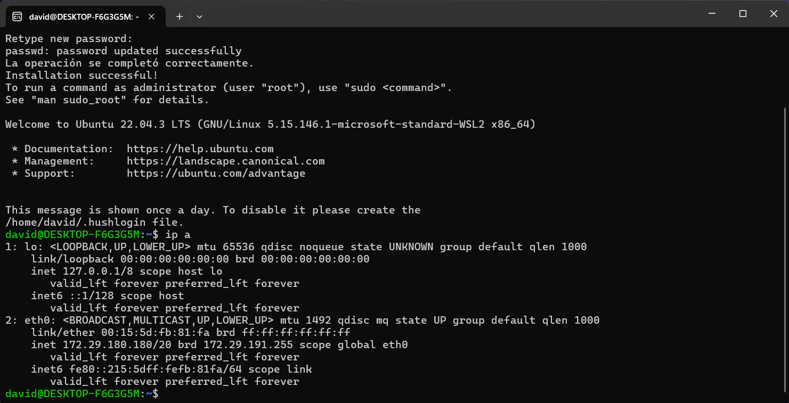
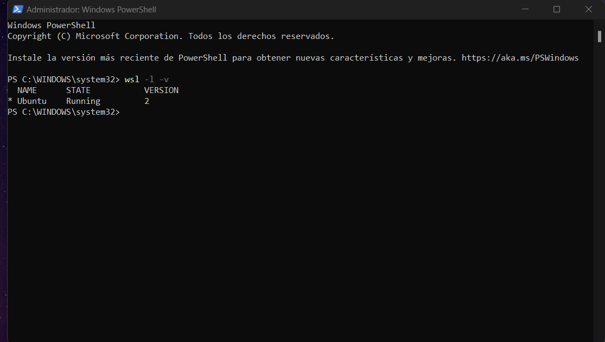
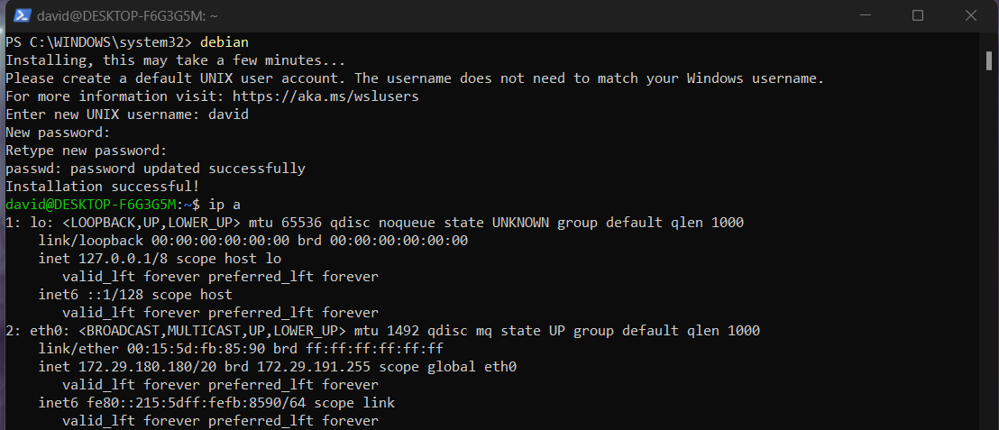

## Soy David Alvarez

### Paso 1 
- Abrimos Powershell **como administrador** e instalamos WSL con el comando  ` wsl --install `  ( Por defecto se nos instalara **Ubuntu** )

 
  
 

### Paso 2 
- Comprobamos otras distribuciones que podemos instalar con ` wsl --list --online` .

  

### Paso 3 
- Instalamos **Debian** tambien con `wsl --install -d Debian ` .

   

### Paso 4
- Una vez que hayamos instalado ambas distribuciones deberemos **reiniciar** el pc . Cuando lo reiniciemos se nos abrirá una ventana para introducir el usuario y contraseña de nuestro Ubuntu.

   

- Una vez hecho ya tendremos nuestro ubuntu listo para funcionar.

  

  
### Paso 5 
- Comprobamos que Ubuntu esta instalado y corriendo con ` wsl -l -v `
  

  
### Paso 6
- Para iniciar Debian solo tendremos que poner en Powershell su nombre , Debian. Nos pedira que nos logeemos con nombre de usuario y contraseña y ya estará listo para funcionar.

  
