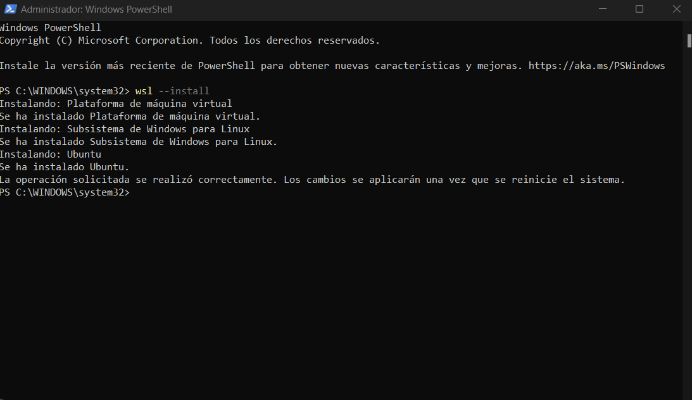
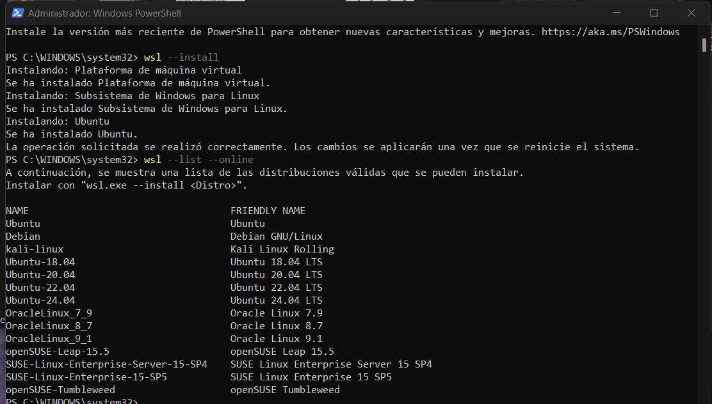

## Soy David Alvarez

### Paso 1 
- Abrimos Powershell ** como administrador ** e instalamos WSL con el comando  ` wsl --install `  ( Por defecto se nos instalara Ubuntu )
  
 

### Paso 2 
- Comprobamos otras distribuciones que podemos instalar con ` wsl --list --online` .

  

### Paso 3 
- Instalamos Debian tambien con `wsl --install -d Debian ` .
